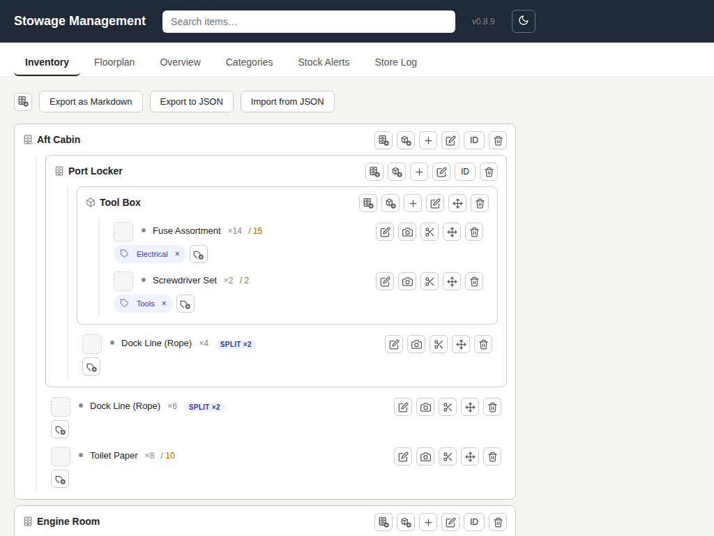
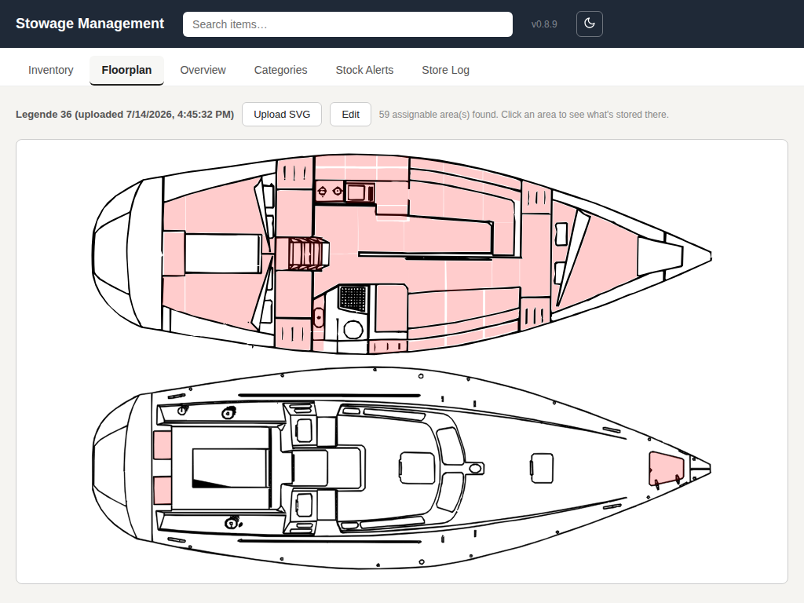
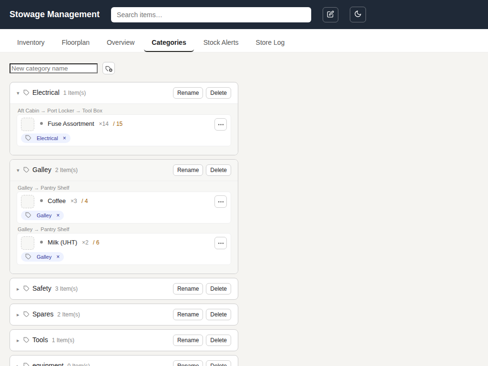
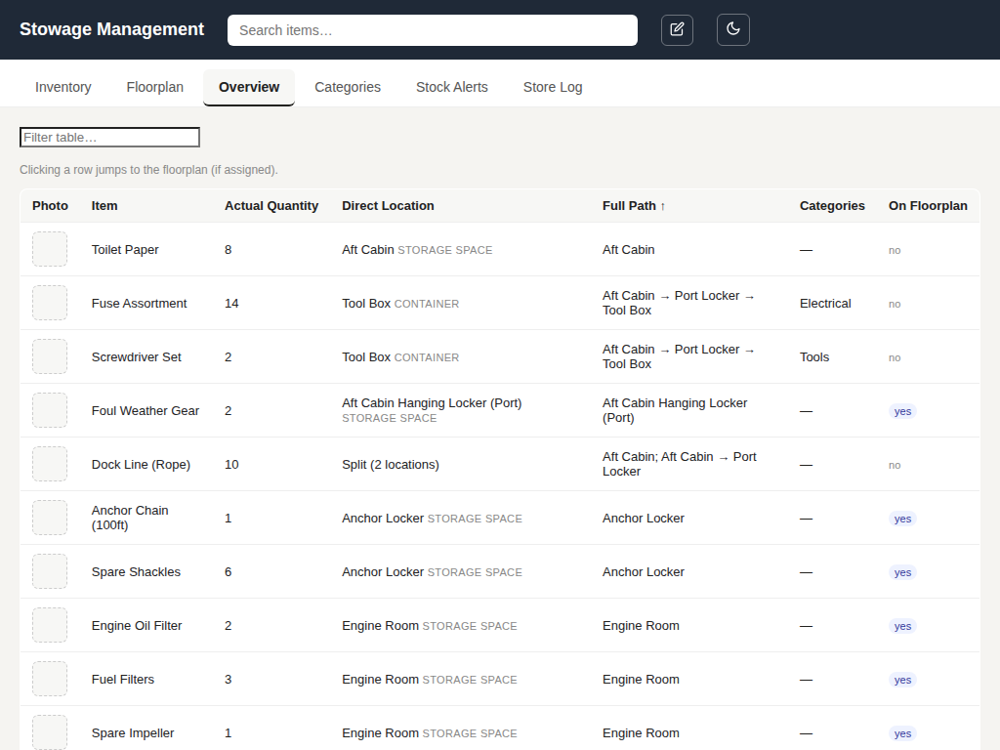
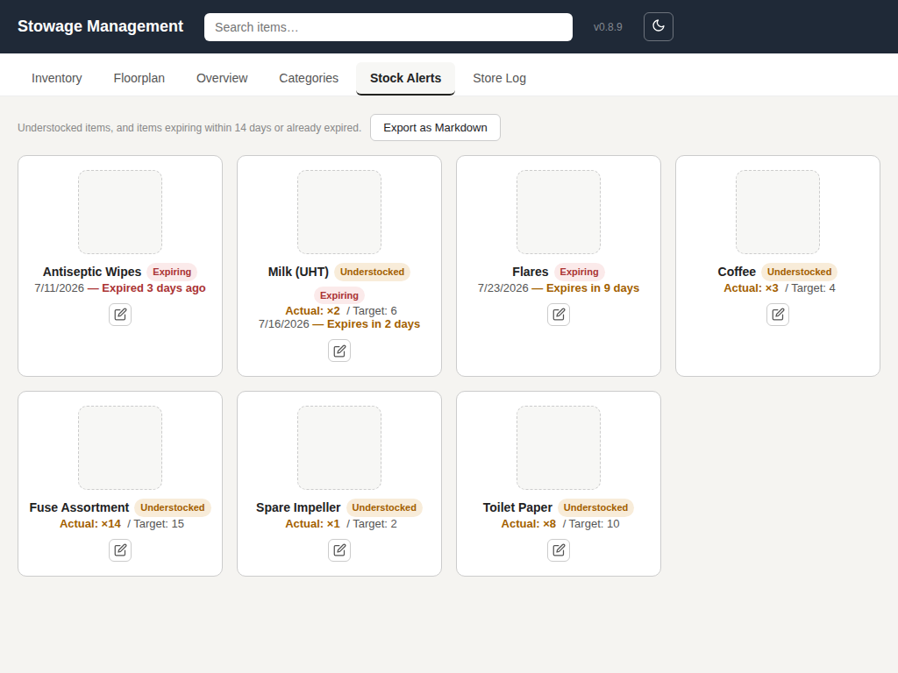
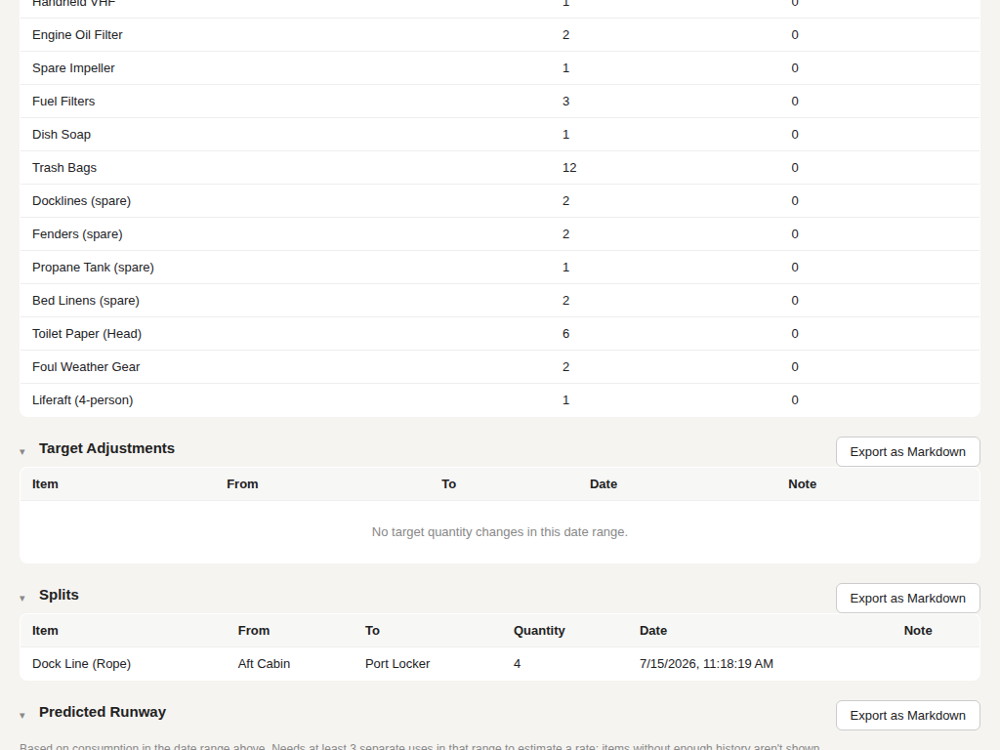

# SignalK Stowage Management

> ⚠️ **Warning:** this is 100% vibecoded AI slop, install and use at your own risk, and always remember: only you can prevent grey goo! never release nanobot assemblers without replication limiting code.

Inventory manager for Signal K Server. Organize items into containers and
storage spaces (nested to any depth), track actual vs. target quantities,
attach photos and markdown notes, upload an SVG floorplan of your boat, map
areas on the floorplan to storage spaces, and make the matching area blink
(or pop open a contents list) when you search for an item.

## Installation

**Requires Node.js 22.5.0 or newer** (uses the built-in `node:sqlite` module —
no native dependencies to compile, so installation is simple on any platform,
including the Signal K App Store's script-free install process).

**Not compatible with Victron Cerbo GX / Venus OS**, at least as of this
writing — those ship Node.js 20, which predates `node:sqlite`. This plugin
won't run there until Venus OS bundles a newer Node.js version.

**Via the Signal K App Store (recommended):** open the Signal K Admin UI,
go to **Server → App Store**, search for "Stowage Management", and click
**Install**. Restart the server when prompted, then enable the plugin under
**Server → Plugin Config**.

**Manual installation**, if you'd rather not use the App Store:

1. Copy the folder into your Signal K directory, e.g.
   `$HOME/.signalk/node_modules/signalk-stowage-mgmt` — or develop locally and
   link it in with `npm link` (see the Signal K plugin docs).
2. Install dependencies:
   ```
   cd signalk-stowage-mgmt
   npm install
   ```
3. Restart the Signal K server.
4. In the Admin UI, enable the plugin under **Server → Plugin Config**
   ("Stowage Management").
5. The webapp is then available at:
   `http://{skserver}:3000/signalk-stowage-mgmt/`
   (also linked from the Webapps list in the Admin UI, as "Stowage
   Management").

## Usage

**Inventory (tab):**



- "+ Storage Space" (toolbar) creates a new top-level storage space (e.g.
  "Lazarette"). Every node also has its own "+ Storage Space", for nesting
  one inside another (e.g. "Port Locker" inside "Aft Cabin") — storage
  spaces can be mapped to a floorplan area at any depth, not just at the
  top level.
- Per node: "+ Container" (nestable to any depth), "+ Item", plus icon
  buttons on each item: edit (properties), photo, split, move, delete,
  add category. Collapsed behind a single "..." by default — click it to
  temporarily reveal that chip's buttons, or turn on the "Edit mode"
  toggle in the header (next to the theme toggle) to always show every
  chip's buttons app-wide.
- Containers can be dragged directly onto another container or storage
  space to move them (or dragged onto the floating "Not Stored" panel to
  detach them to the top level). Items can likewise be dragged onto any
  storage space/container, or dragged straight onto an assigned floorplan
  area to stow them there. Storage spaces aren't draggable — once placed,
  re-parenting one takes deleting and recreating it under the new parent.
- Items show actual quantity (click to edit inline, with +/- steppers) and
  target quantity, if set, as "×3 / 6".
- "Export as Markdown" renders the whole inventory tree (storage spaces,
  nested containers, items with quantities/targets/categories, plus a "Not
  Stored" section for orphans) into a copyable markdown document.
- "Export to JSON" downloads a full snapshot (see the API table below for
  exactly what's in it); "Import from JSON" **replaces** the current
  inventory with a previously exported file, after a confirmation dialog —
  it's a restore, not a merge, so export a fresh backup first if you're
  not sure.
- The floating "Not Stored" panel (bottom/top-right of the screen,
  depending on context) lists any containers with no parent and any items
  with no location — normally hidden, it appears automatically whenever
  something is orphaned or while a drag is in progress, and doubles as a
  drop target to detach things.
- **Splitting an item's stock across locations:** click "Split" on any
  item chip (works whether the item is already split or not), choose a
  destination and quantity, and it appears at both places. A split item
  renders as one chip per location, each showing that location's own
  quantity — editable inline just like a normal item's (setting it to 0
  removes that placement; if only one location is left, the item
  automatically reverts to being a plain, unsplit item); drag a specific
  chip to move just that portion; use "Split" again to redistribute
  further. The item's overall quantity is always the sum of its
  placements, and is read-only in the Item Properties dialog (and on the
  Understocked page, since there's no single location to attribute a
  change to) — edit it via a placement chip or the Split dialog instead;
  name, notes, target quantity, photo, and categories stay item-level and
  editable as normal regardless. While dragging any item, a floating
  "Drop here to split" panel appears (alongside "Not Stored") — dropping
  onto it opens the Split dialog for whatever you were carrying,
  defaulting the source to wherever it was just dragged from. Searching
  for or locating a split item blinks every one of its mapped areas on
  the floorplan at once.

**Item properties (edit icon on any item):**
- Name, actual quantity, target quantity (leave blank for "no target").
- Notes: a small dependency-free markdown editor with **Show** (rendered
  preview, default) and **Edit** (raw markdown) tabs. Supports headings,
  **bold**, _italic_, `code`, links, and lists.
- Photo (separate camera icon): upload an image, drag to pan and use the
  slider to zoom, then save a square-cropped thumbnail. Shown on the item
  row, the Overview table, and the Understocked page.
- Attachments: upload any file (manuals, spec sheets, receipts — no size
  limit or type restriction). Click one to open/download it via the
  browser's native handling. Stored on disk, not in the database.

**Floorplan (tab):**



- Don't have an SVG floorplan of your boat yet? [ClearShip's free Boat
  Floor Plan Editor](https://clearship.app/tools/floor-plan) is a nice
  way to make one — draw your layout in the browser with predefined
  hull/berth/galley/engine symbols, or trace over a photo of your
  manual's deck plan, then export straight to SVG. No signup, nothing
  leaves your browser, and the exported file drops right into the
  upload step below.
- Only the single most recently uploaded SVG is shown. Uploading a new one
  replaces it. If the new SVG has elements with the **same id** as ones your
  storage spaces were already mapped to, those assignments carry over
  automatically — no need to re-map anything just because you touched up
  the file in your SVG editor. Only storage spaces whose matching area is
  genuinely gone (a different or removed id) will lose their assignment,
  and you'll get a confirmation warning naming exactly those, since that
  part can't be undone.
- **Important:** only SVG elements (`path`, `polygon`, `rect`, `circle`,
  `ellipse`) that already have a **custom** `id` attribute in the SVG
  source can be clicked and assigned. Auto-generated IDs from your SVG
  editor (e.g. Inkscape's default `path10340`, `rect4821-3`, etc.) are
  ignored, so tracing a floorplan without renaming anything won't turn
  every single shape into a storage area. Give the shapes you want to use
  a custom ID, e.g. in Inkscape's "Object Properties" panel, or by editing
  the SVG source directly.
- **Display mode** (default): click an area to pop open a panel showing
  everything stored in the matching storage space (fully interactive —
  same container/item rendering as the Inventory tab).
- **Edit mode** (toggle via the "Edit"/"Save" button): unassigned areas are
  highlighted light blue. Click an area to open the assignment dialog,
  where you can pick an existing storage space, or type a name and click
  "+ Storage" to create a new one on the spot and assign it in one step —
  the field is pre-filled with a name guessed from the area's SVG id
  (e.g. `area-navtable` → "Navtable"), which clears on first click so you
  can type your own. Existing storage spaces are listed by their full path
  (e.g. "Aft Cabin → Port Locker"), not just their bare name, since nested
  storage spaces can share a name at different depths (e.g. a "Port
  Locker" under both Aft Cabin and Fwd Cabin).
- If two areas visually overlap on the floorplan (e.g. a locker drawn
  above a berth, with storage space behind/below it), only the topmost one
  is clickable. For the one underneath, use the **"ID"** button on
  that storage space (in the Inventory tree) to type its SVG element id
  directly instead — no click required. Leave the field blank to remove
  the mapping.

**Categories (tab):**



- "+ Category" creates a new category. Four defaults are seeded on first
  start: "food", "spare part", "equipment", "tools".
- Each category is a collapsible fold-down; click its header to expand and
  see every item that carries it (with location and the full item row,
  fully interactive). Rename or delete from the header; the count shown is
  how many items currently carry that category.
- Deleting a category removes it from every item that had it — the items
  themselves are untouched.

**On each item:**
- Category badges are shown under the item; click the "×" on a badge to
  remove that category, or use the category dialog to toggle several at
  once by clicking chips (green = assigned).
- An item can carry any number of categories at once.

**Overview (tab):**



- Table of all items with thumbnail, actual quantity, direct location,
  full path (e.g. "Lazarette → Tool box"), categories, and whether the
  location is mapped on the floorplan.
- Click column headers to sort, use the text field to filter by item name,
  direct location, and path.
- Clicking a row jumps to the Floorplan tab and makes the area blink, same
  as search (if it's mapped).

**Stock Alerts (tab):**



- Lists every item that's understocked (target quantity set and actual
  below it), expiring (already expired, or expiring within 14 days — a
  fixed window for now), or both — most urgent first (expiring items
  soonest/most-overdue first, then understocked-only items alphabetically).
  Each shown as a large-thumbnail chip with name, an "Understocked" and/or
  "Expiring" badge, editable actual quantity, target quantity, and an edit
  button.
- Set an optional expiration date on an item via the Item Properties
  dialog. One date per item — if you buy the same thing at different
  times with different expiration dates, there's currently no way to
  track those as separate batches on a single item (create separate items
  if you need that today; see `ROADMAP.md`).
- Its "Export as Markdown" button produces a shopping list grouped by
  shop, covering both understocked and expiring items — an expiring item
  is treated as if it had 0 in stock (so it's listed at its full target
  quantity, or its current on-hand quantity if no target is set), with
  an "expires \<date\>" note appended. To assign an item to a shop, put a
  line reading `source: <shop name>` anywhere in that item's notes (e.g.
  `source: West Marine`) — it can be on its own line alongside other
  notes text, and matching is case-insensitive. Items without a `source:`
  line are grouped under "No Shop Specified". Within each shop's group,
  items are sorted by category.
- Expiration status isn't tracked in the Store Log.

**Store Log (tab):**



- An audit trail of item creation, actual/target quantity changes,
  deletion, and splits — useful for questions like "how many rolls of
  toilet paper did we use last month?" Moving an item (or one placement
  of a split item) between locations is not logged.
- Preset buttons (Last Week/Month/Quarter/6 Months/Year) or manual date
  pickers set the range shown, shared across all five sections below.
- **Individual Movements**: one row per movement event (item creation,
  quantity increase/decrease, or deletion), newest first — item, Added or
  Used amount, timestamp, and note.
- **Aggregate Movements**: Added/Used totals per item across the whole
  date range, sorted by Used, descending.
- **Target Adjustments**: a plain chronological list (target quantity is a
  goal, not a consumed resource, so it isn't aggregated) — From, To, date,
  and the note if one was left.
- **Splits**: a chronological list of split actions — Item, From, To,
  Quantity, date, and the note if one was left. Ordinary moves (including
  moving a single placement of a split item) aren't split actions and
  don't appear here.
- **Predicted Runway**: for items with at least 3 separate consumption
  events within the selected date range, projects a consumption rate
  (total consumed ÷ days in range) and estimates days remaining and an
  approximate run-out date from the item's current stock. Items with
  fewer than 3 qualifying events in the range aren't shown — not enough
  data to estimate a rate. Sorted soonest-to-run-out first. Restocking
  doesn't affect the rate, only the current-stock starting point.
- Adding a note to a quantity change: only available from the Item
  Properties dialog's Save action, not the quick inline quantity editor.
- Each section has its own "Export as Markdown" button, producing just
  that section's table as its own document.

**Search:**
- Type into the search box at the top, click a result. Matches against
  both the item's name and its notes — a match found only in notes shows
  a short snippet of surrounding text under the result so you can see why
  it matched.
- The app automatically switches to the Floorplan tab, loads the matching
  plan, and makes the corresponding area blink for 6 seconds — even if the
  item is nested several containers deep (the app walks up the parent
  chain until it finds a mapped storage space). For an item split across
  locations, every mapped area blinks at once.

## Data model

SQLite database stored under the Signal K data directory (`inventory.db`).
All primary keys are UUIDs (`TEXT`), all tables have `created_at` (or
`uploaded_at`) defaulting to the current timestamp.

**`floorplans`**

| Column | Type | Notes |
|---|---|---|
| `id` | TEXT, PK | |
| `name` | TEXT | Filename the SVG was uploaded as (extension stripped) |
| `svg_content` | TEXT | Raw SVG markup, stored as-is |
| `uploaded_at` | TEXT | Used to determine "most recent" for display |

Only the most recently uploaded floorplan is ever shown in the UI; older
rows are deleted (after their area mappings are cleared) when a new one is
uploaded, so in practice this table normally holds at most one row.

**`locations`** — storage spaces and containers share one table

| Column | Type | Notes |
|---|---|---|
| `id` | TEXT, PK | |
| `name` | TEXT | |
| `type` | TEXT | `storage_space` or `container` (CHECK constraint) |
| `parent_id` | TEXT, FK → `locations.id` | `ON DELETE SET NULL`. Nesting: containers can nest inside containers or storage spaces to any depth; storage spaces can likewise nest inside another storage space or container to any depth (or have `parent_id = NULL` for top-level) — a storage space maps to a floorplan area independently of its own nesting depth |
| `floorplan_id` | TEXT, FK → `floorplans.id` | `ON DELETE SET NULL`. Only meaningful on `storage_space` rows |
| `svg_element_id` | TEXT | The `id` attribute of the matched SVG shape. Only meaningful on `storage_space` rows |

**`items`**

| Column | Type | Notes |
|---|---|---|
| `id` | TEXT, PK | |
| `name` | TEXT | |
| `actual_quantity` | INTEGER, default 1 | How many you actually have. For a split item (see `item_placements` below), this is the sum of its placements' quantities and can only change via `POST /items/:id/split` (reallocating between locations) or `PATCH /items/:id/placements/:placementId` (changing one placement's quantity directly) |
| `target_quantity` | INTEGER, nullable | Desired stock level; `NULL` means "no target set" and excludes the item from the Understocked page regardless of `actual_quantity` |
| `notes` | TEXT, nullable | Free-text, rendered as markdown in the UI. (Earlier versions had a separate `description` column; it was merged into `notes` and dropped.) |
| `location_id` | TEXT, FK → `locations.id` | `ON DELETE SET NULL`. `NULL` means "not stored anywhere" **or** "this item is split across locations" — check `item_placements` to tell which |
| `thumbnail` | TEXT, nullable | Square-cropped photo as a `data:` URI (JPEG), or `NULL` |
| `expires_at` | TEXT, nullable | Optional expiration date (`YYYY-MM-DD`). Not tracked in `item_log` |

**`item_placements`**

| Column | Type | Notes |
|---|---|---|
| `id` | TEXT, PK | |
| `item_id` | TEXT, FK → `items.id` | `ON DELETE CASCADE` |
| `location_id` | TEXT, FK → `locations.id`, nullable | `ON DELETE SET NULL`. `NULL` means this portion is unassigned ("no location") |
| `quantity` | INTEGER | |

An item has **no** rows here in the normal case — its stock lives entirely
in `items.location_id`/`actual_quantity`. Rows only appear once an item has
been split across two or more locations via `POST /items/:id/split`, at
which point `items.location_id` becomes `NULL` and `items.actual_quantity`
tracks the sum. If a split later collapses back down to a single location
(e.g. moving everything back together), the placement rows are removed and
the item reverts to the plain representation automatically.

**`item_log`**

| Column | Type | Notes |
|---|---|---|
| `id` | TEXT, PK | |
| `item_id` | TEXT | Not a foreign key — rows survive item deletion |
| `item_name` | TEXT | Snapshotted at the time of the event, so history reads correctly after renames |
| `event` | TEXT | `created`, `actual_quantity`, `target_quantity`, `deleted`, or `split` |
| `old_value` / `new_value` | INTEGER, nullable | The quantity before/after. `NULL` for a target quantity that was unset, or for a `split` event (see `from_location_id` etc. below instead) |
| `delta` | INTEGER | `new_value - old_value`. Always `0` for a `split` event, since splitting reallocates existing stock rather than adding or removing it |
| `note` | TEXT, nullable | Optional, set via the Item Properties dialog (quantity changes) or the Split dialog (splits) |
| `from_location_id` / `from_location_name` | TEXT, nullable | Set only for `split` events. Name is snapshotted, same reasoning as `item_name`. `NULL` means "no location" |
| `to_location_id` / `to_location_name` | TEXT, nullable | Set only for `split` events, same conventions as `from_location_id` |
| `quantity` | INTEGER, nullable | Set only for `split` events — how many units moved |
| `created_at` | TEXT | |

A row is written whenever an item is created, its `actual_quantity` or
`target_quantity` changes, it's deleted (logged as using up whatever
quantity remained), or its stock is split across locations via
`POST /items/:id/split`. Moving an item (or one placement of a split item)
between locations is **not** logged — only the act of splitting is.


**`categories`**

| Column | Type | Notes |
|---|---|---|
| `id` | TEXT, PK | |
| `name` | TEXT, UNIQUE | |

**`item_categories`** — many-to-many join table

| Column | Type | Notes |
|---|---|---|
| `item_id` | TEXT, FK → `items.id` | `ON DELETE CASCADE` |
| `category_id` | TEXT, FK → `categories.id` | `ON DELETE CASCADE` |

Composite primary key `(item_id, category_id)`.

**`item_attachments`**

| Column | Type | Notes |
|---|---|---|
| `id` | TEXT, PK | Also used as the on-disk filename |
| `item_id` | TEXT, FK → `items.id` | `ON DELETE CASCADE` |
| `filename` | TEXT | Original filename as uploaded — display-only, never used to build a filesystem path |
| `mime_type` | TEXT | From the upload's `Content-Type` header |
| `size` | INTEGER | Bytes |
| `uploaded_at` | TEXT | |

Unlike `thumbnail` (a small `data:` URI stored inline), attachment files are
unbounded in size and count, so they're **not** stored in SQLite — only
this metadata row is. The file itself lives on disk at
`<dataDir>/attachments/<item_id>/<attachment_id>`, deleted individually via
`DELETE /items/:id/attachments/:attachmentId` or all at once (best-effort)
when the item itself is deleted.

Indexes exist on `locations.parent_id`, `locations.floorplan_id`,
`items.location_id`, `item_categories.category_id`, and
`item_attachments.item_id`.

## API (under `/plugins/signalk-stowage-mgmt`)

Also published as an OpenAPI 3.0 spec (`openApi.json`), which renders in
the Signal K Admin UI under **Documentation → OpenAPI** once the plugin is
enabled.

All request/response bodies are JSON. Errors are `{ "error": "..." }` with
an appropriate HTTP status code.

**Known external consumers**

`signalk-maintenance-tracker`'s `inventory-interaction` feature calls this
API directly — the first (and so far only) external consumer. It depends on:

- `GET /items` — called same-origin, straight from its browser frontend
  (parts picker, stock badges), not proxied through its own backend.
- `GET /items/:id` — backend lookup before decrementing stock.
- `PATCH /items/:id` — decrements `actual_quantity` for non-split items.
- `PATCH /items/:id/placements/:placementId` — same, per-placement, for
  split items.
- The `Item` shape's `id`, `name`, `actual_quantity`, `target_quantity`,
  and `placements` (each `{ id, location_id, quantity }`).
- The `{ "error": "..." }` error shape, to distinguish "no such item" from
  "route doesn't exist" on `GET /items/:id`'s 404.

There's no version negotiation between the two plugins, so a breaking
change to any of the above won't fail loudly on either side — it'll just
silently break the integration. **Call this out explicitly in the
CHANGELOG** when it happens, even if the change doesn't touch this
plugin's own frontend at all. (See issue #18 for the fuller discussion —
no versioning/deprecation process beyond this is planned for now.)

**Locations** (storage spaces & containers)

| Method & path | Purpose |
|---|---|
| `GET /locations` | List all locations |
| `POST /locations` | Create. Body: `{ name, type, parent_id? }` (`type` is `storage_space` or `container`) |
| `PATCH /locations/:id` | Rename. Body: `{ name }` |
| `PATCH /locations/:id/move` | Re-parent. Body: `{ parent_id }` (omit/null for top-level). Rejects cycles |
| `PATCH /locations/:id/svg-mapping` | Assign/clear a floorplan area. Body: `{ floorplan_id, svg_element_id }` (storage spaces only) |
| `DELETE /locations/:id` | Delete (only if it has no child locations or items) |

**Items**

| Method & path | Purpose |
|---|---|
| `GET /items` | List all items, each with a `categories` array (`[{ id, name }]`) and a `placements` array (empty unless split — see below). Optional `?q=<text>` filters to items whose **name** contains the text (case-insensitive substring match; notes aren't searched). Returns every match, unbounded |
| `GET /items/:id` | Get a single item, same shape as an entry in the list above |
| `POST /items` | Create. Body: `{ name, actual_quantity?, target_quantity?, notes?, location_id?, category_ids?, note?, expires_at? }`. `note` is recorded in the item log for the initial quantity, not stored on the item itself |
| `PATCH /items/:id` | Partial update. Body: any of `{ name, actual_quantity, target_quantity, notes, note, expires_at }`. `target_quantity`/`notes`/`expires_at` support explicit `null` to clear them (distinct from omitting the key, which leaves them unchanged). `note` is logged against whichever of `actual_quantity`/`target_quantity` changed in this request (both, if both changed) — it isn't a field on the item itself. `expires_at` changes are not logged. **`actual_quantity` is rejected with 400 if the item is split** — use `PATCH /items/:id/placements/:placementId` (change one placement's quantity) or `POST /items/:id/split` (reallocate between locations) instead |
| `PATCH /items/:id/thumbnail` | Set/clear the photo. Body: `{ thumbnail }` — a `data:` URI string, or `null`/omitted to remove it |
| `PATCH /items/:id/move` | Move a whole (unsplit) item to a different location. Body: `{ location_id }` (omit/null to unassign). Not logged. **Rejected with 400 if the item is split** — move a specific placement via the endpoint below instead |
| `GET /items/:id/placements` | List an item's placements (`[{ id, location_id, location_name, quantity }]`). Empty array means it isn't split |
| `PATCH /items/:id/placements/:placementId/move` | Move one placement of a split item to a different location. Body: `{ location_id }` (omit/null for "no location"). Not logged, same as an ordinary move |
| `PATCH /items/:id/placements/:placementId` | Set one placement's quantity directly — the split-item equivalent of editing `actual_quantity`. Body: `{ quantity, note? }`. Logged as an ordinary `actual_quantity` event (not `split`), since this is a real stock change, not a reallocation. Setting a placement to `0` removes it; if that leaves only one placement, the item automatically reverts to the plain (unsplit) representation |
| `POST /items/:id/split` | Move `quantity` units of an item from `from_location_id` to `to_location_id` (both nullable, for "no location"), splitting the item across locations if it wasn't already. If not yet split, `from_location_id` must match the item's current `location_id`. If a split collapses everything back into one location, the item automatically reverts to the plain (unsplit) representation. Body: `{ from_location_id?, to_location_id?, quantity, note? }`. Always logged as a `split` event |
| `POST /items/:id/categories` | Add a category. Body: `{ category_id }` |
| `DELETE /items/:id/categories/:categoryId` | Remove a category |
| `DELETE /items/:id` | Delete the item. Logs a `deleted` event using up whatever quantity remained |
| `GET /items/:id/locate` | For a normal item: walks the parent chain upward until it finds a mapped storage space; returns `{ item_id, path, floorplan_id, svg_element_id, storage_space }`, or 404 with the (unmapped) `path` if none is found. For a **split** item: returns `{ item_id, split: true, matches: [...] }` — one entry per placement that resolves to a mapped storage space (placements with no mapped area are silently skipped; 404 only if none resolve) |
| `GET /items/:id/attachments` | List an item's attachments (`[{ id, item_id, filename, mime_type, size, uploaded_at }]`) |
| `POST /items/:id/attachments` | Upload a file. **Body is the raw file bytes**, not JSON — set `Content-Type` to the file's MIME type, and pass the original filename URI-encoded in the `X-Filename` header. No size limit, no file-type restriction |
| `GET /items/:id/attachments/:attachmentId` | Download/view the raw file, with its original `Content-Type` and a `Content-Disposition` set from `filename` — the browser handles it natively (inline for PDFs/images, download for anything else) |
| `DELETE /items/:id/attachments/:attachmentId` | Delete an attachment (row + file on disk) |

**Item Log**

| Method & path | Purpose |
|---|---|
| `GET /item-log` | List log entries, oldest first. Optional `?start=` / `?end=` query params (inclusive dates, e.g. `2026-06-01`) filter the range; omit both for the full history |

**Categories**

| Method & path | Purpose |
|---|---|
| `GET /categories` | List all categories |
| `POST /categories` | Create. Body: `{ name }` (409 if the name already exists) |
| `PATCH /categories/:id` | Rename. Body: `{ name }` (409 on name clash) |
| `DELETE /categories/:id` | Delete (also removes it from every item that had it, via `ON DELETE CASCADE`) |

**Floorplans**

| Method & path | Purpose |
|---|---|
| `GET /floorplans` | List floorplans (id/name/uploaded_at only), newest first |
| `GET /floorplans/:id` | Get one floorplan including its full `svg_content` |
| `POST /floorplans` | Upload. Body: `{ name, svg_content }` (raw SVG markup as text) |
| `DELETE /floorplans/:id` | Delete (400 if any storage space is still mapped to it — clear those mappings first) |

**Backup / restore**

| Method & path | Purpose |
|---|---|
| `GET /export` | Full inventory snapshot as JSON: categories, locations (with hierarchy and floorplan mappings), and items (with their categories, placements, and attachment *metadata*). Deliberately excludes floorplan SVG content, attachment file contents, and Store Log history — see below |
| `POST /import` | **Replaces** categories/locations/items entirely with the given snapshot (same shape `GET /export` returns) — a restore, not a merge. Floorplans, attachment files, and Store Log history are never touched. Returns `{ restored: { categories, locations, items }, dropped_floorplan_mappings }` |

A snapshot only carries a location's floorplan *mapping* (`floorplan_id` +
`svg_element_id`), not the floorplan itself — so a mapping only survives
`/import` if that exact `floorplan_id` still exists in the *target*
database. This makes the feature best suited to backup/restore on the same
instance (protecting against accidental data loss) rather than migrating
to a different one; a mapping that can't be resolved is silently dropped
(not a fatal error) and counted in `dropped_floorplan_mappings`. Original
ids are preserved on restore, so anything depending on stable item/location
ids (see "Known external consumers" above) keeps working after a restore.
`/import` is a full replace of everything in scope — there's currently no
merge/append mode (see issue #26).

## Known limitations / possible next steps

- No multi-user permissions; relies on Signal K's built-in security if
  enabled.
- No undo for deletions.
- SVG upload only does a superficial check (`<svg` in the text) — no
  server-side sanitizing. Fine for private, on-boat use; worth hardening
  if the server is exposed publicly.
- The markdown renderer for notes is a small hand-rolled subset (headings,
  bold/italic, inline code, links, lists) — not a full CommonMark
  implementation.
